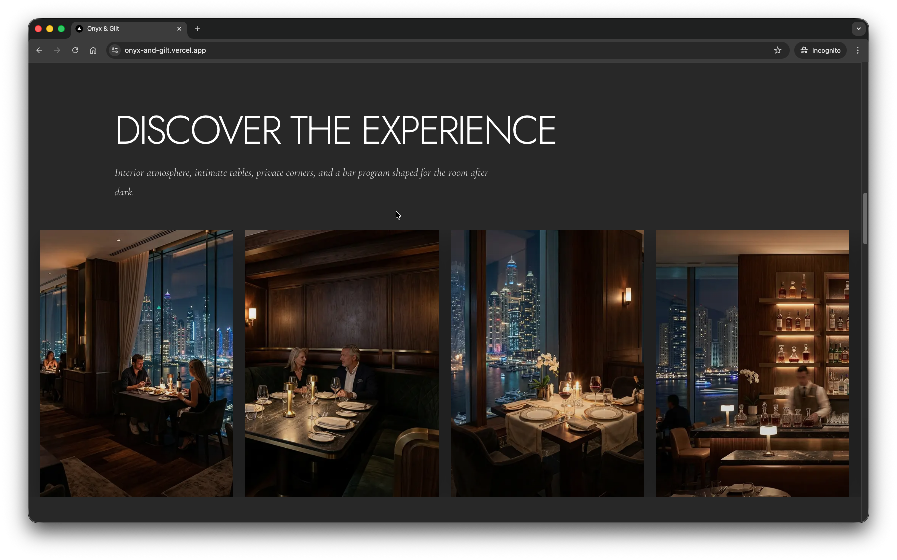
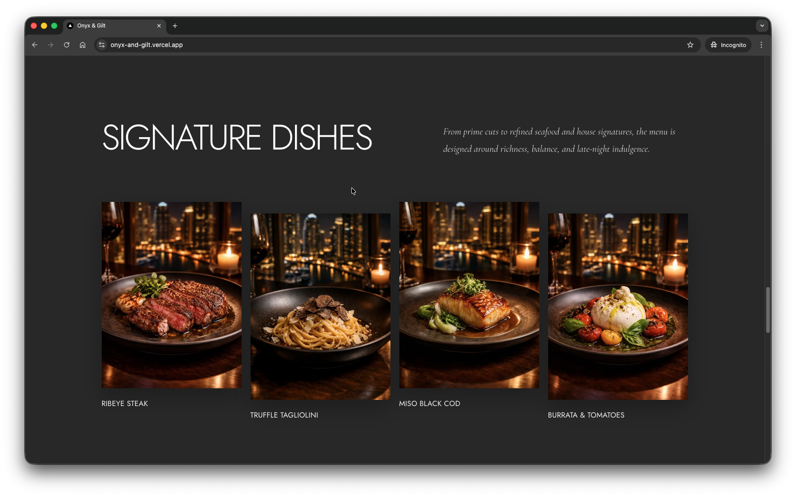

# Onyx & Gilt

A cinematic luxury restaurant website concept for a fictional high-rise dining and cocktail destination above Dubai Marina.

**Live site:** [onyx-and-gilt.vercel.app](https://onyx-and-gilt.vercel.app/)

  
  

---

## Overview

**Onyx & Gilt** is a premium front-end concept project built to present a luxury hospitality brand through mood, pacing, and visual storytelling.

Rather than treating the site as a standard restaurant landing page, the experience was designed as a composed digital brand piece: cinematic, image-led, dark in tone, and intentionally restrained. The goal was to create something that feels closer to a high-end editorial experience than a template-driven marketing site.

---

## Live Demo

Visit the deployed project here:

**[https://onyx-and-gilt.vercel.app/](https://onyx-and-gilt.vercel.app/)**

---

## Technology Stack

This project uses a modern React-based front-end stack with an emphasis on structure, maintainability, and visual precision.

### Core technologies

- **Next.js**  
  Used as the application framework for routing, project structure, asset handling, and production deployment.

- **React**  
  Used to build the UI through reusable, composable components.

- **TypeScript**  
  Used for stronger component contracts, safer refactoring, and more reliable long-term maintenance.

- **Tailwind CSS**  
  Used for layout, spacing, positioning, responsive behaviour, and utility-first styling.

- **CSS Modules**  
  Used for isolated component styling where a more controlled visual treatment was needed, particularly for custom button work.

- **Vercel**  
  Used for deployment and production hosting.

---

## Design Philosophy

This project was built with the same mindset used in premium front-end work for high-end brands: restraint first, decoration second.

The strongest luxury interfaces are rarely the busiest. They feel measured, calm, and intentional. That principle shaped every part of the build, from section spacing to motion design to typography placement.

### Core front-end principles behind the build

- **Clear component boundaries**  
  Large page sections are separated into focused components to keep the codebase easier to reason about and scale.

- **Visual hierarchy over visual noise**  
  Layout, spacing, and composition do more work here than visual effects.

- **Consistent design language**  
  Repeated styling decisions, especially around buttons, overlays, tone, and spacing, help the entire site feel authored as a single system.

- **Atmosphere through pacing**  
  The page flow was designed to move with rhythm rather than density.

- **Brand-sensitive motion**  
  Motion is used to support tone and confidence, not to show off animation for its own sake.

---

## Animation and Motion

The animation language in this project is subtle by design.

For a luxury hospitality concept, aggressive or overly playful animation would weaken the brand. The motion here is intentionally controlled and is used only where it improves the experience.

### 1. Hero video background

The hero uses a full-screen looping video to establish mood immediately.

This is not simply a decorative background. It acts as the opening cinematic frame of the site. The overlay treatment and copy placement were built to preserve readability while still letting the video carry atmosphere.

### 2. Scroll cue treatment

The hero includes a scroll cue to gently suggest continuation down the page.

It is a small interaction detail, but an important one. In polished front-end work, these cues help the page feel guided rather than abruptly assembled.

### 3. Button hover behaviour

The custom glass-style buttons use restrained hover transitions with:

- gradient movement
- subtle press feedback
- layered inner and outer surfaces
- controlled contrast shifts

The result is meant to feel tactile and refined, closer to a premium material finish than a standard UI control.

### 4. Layout-driven motion

Not all motion is literal animation.

A significant part of the movement in this site comes from section sequencing, image scale, open space, and contrast between dense and quiet moments. This is often more effective in luxury interface work than filling the experience with transitions.

---

## Custom UI Elements

### Glass button system

The contact button and social buttons share the same visual language:

- rounded premium silhouette
- metallic silver shell
- darker inset face
- soft hover response
- tactile active state

This consistency matters. High-end UI work is often defined by system discipline more than by individual flourishes.

### Social button treatment

The social section uses buttons designed to feel like part of the same component family as the contact CTA, rather than generic icon links. This keeps the final sections visually coherent and prevents the footer area from feeling detached from the rest of the experience.

---
